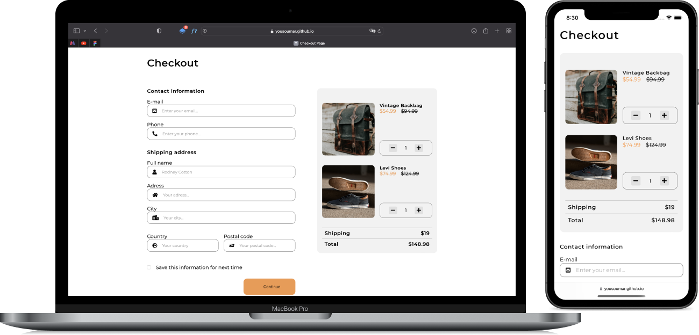

Intégration d'une page `responsive` de commande en ligne en `HTML` et `CSS`.

C'est un <a href="https://devchallenges.io/challenges/0J1NxxGhOUYVqihwegfO">`challenge`</a> de `devchallenge.io`.

Tout le `challenge` était de styliser des `inputs`.

Visiter en cliquant sur l'image ci-dessous ou sur le lien en bas de la section `About`.

`Note : il s'agit là d'une vieille réalisation de mes débuts mise récemment sur Github.`

<a href = "https://yousoumar.github.io/checkout-page/"></img></a>

